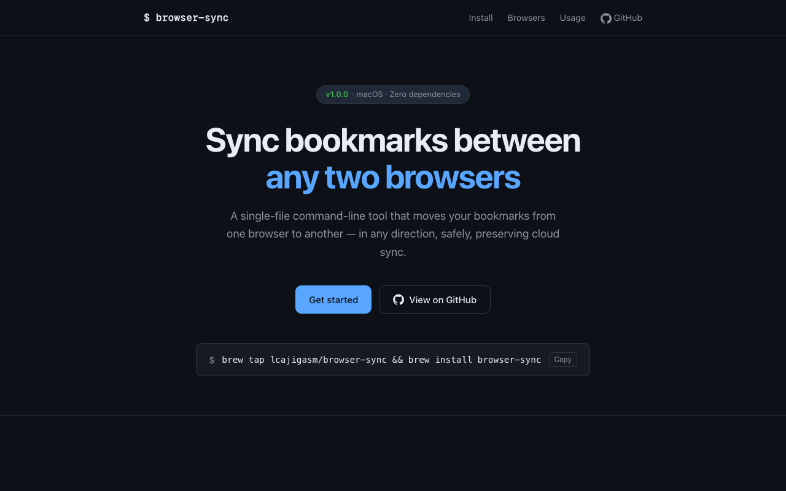

# browser-sync


[](https://lcajigasm.github.io/bookmarks-sync/)

A command-line tool that synchronises bookmarks between any two browsers installed on macOS — in any direction.

**[🌐 lcajigasm.github.io/bookmarks-sync](https://lcajigasm.github.io/bookmarks-sync/)**

[](https://lcajigasm.github.io/bookmarks-sync/)

## Supported browsers

| Browser | Engine | Notes |
|---|---|---|
| Brave | Chromium | Stable channel |
| Google Chrome | Chromium | Stable, Beta, and Dev channels |
| Vivaldi | Chromium | |
| Microsoft Edge | Chromium | |
| Firefox | Gecko | Stable release |
| Firefox Developer Edition | Gecko | Shares the same `profiles.ini` as Firefox |

---

## Prerequisites

- **macOS** (Monterey or later recommended)
- **Python 3.10+** — ships with macOS, no third-party packages required
- At least two browsers from the table above installed under `/Applications`

---

## Installation

### Homebrew (recommended)

```bash
brew tap lcajigasm/browser-sync
brew install browser-sync
```

### Manual

```bash
# 1. Place the script somewhere on your PATH
mkdir -p ~/.scripts/browser
cp browser-sync ~/.scripts/browser/browser-sync
chmod +x ~/.scripts/browser/browser-sync

# 2. Add the directory to your PATH (add to ~/.zshrc or ~/.bashrc)
export PATH="$HOME/.scripts/browser:$PATH"
```

Reload your shell:

```bash
source ~/.zshrc
```

Verify:

```bash
browser-sync --help
```

---

## Usage

### Interactive mode (default)

```bash
browser-sync
```

The tool walks you through two menus:

1. **Source** browser → profile
2. **Destination** browser → profile

It then shows a summary and asks for confirmation before writing anything.

### Dry-run mode

```bash
browser-sync --dry-run
```

Reads the source, prints what would happen, and exits without modifying any file. Useful for verifying the operation before committing to it.

---

## How it works

### Internal pivot format

All bookmark data is normalised to the **Chromium JSON format** as an in-memory intermediate representation. This format has three top-level root objects:

| Key | Description |
|---|---|
| `bookmark_bar` | Bookmarks bar / toolbar |
| `other` | Other bookmarks / menu |
| `synced` | Mobile bookmarks / synced bookmarks |

Each node is either a `url` leaf (with `id`, `guid`, `name`, `url`, `date_added`, `date_modified`) or a `folder` node (same fields plus `children`).

### Conversion paths

```
Chromium → Chromium   JSON file copied; root GUIDs preserved, content GUIDs regenerated
Chromium → Firefox    JSON → SQLite INSERT with Sync tombstones
Firefox  → Chromium   SQLite SELECT → JSON with new GUIDs
Firefox  → Firefox    SQLite → JSON → SQLite with Sync tombstones
```

### Chromium bookmarks file

Located at `<profile>/Bookmarks` (plain JSON). The file contains a `roots` object and a `checksum` field (MD5 over all URL nodes). The tool regenerates the checksum on every write. If the checksum is wrong Chrome recalculates it silently on the next save, so a stale value is harmless.

### Firefox places database

Located at `<profile>/places.sqlite` (SQLite 3). Key tables:

| Table | Purpose |
|---|---|
| `moz_places` | URL index — one row per unique URL |
| `moz_bookmarks` | Bookmark and folder tree |
| `moz_bookmarks_deleted` | Tombstones for Firefox Sync |

The tool opens the **live** database file directly (Firefox must be closed). For reading the source it first copies the database to a temp file so it never touches the original.

---

## Sync persistence

A plain file copy breaks cloud sync because the sync client detects that locally-known GUIDs have disappeared and may push deletions or conflicts. `browser-sync` applies specific strategies for each engine to make the result sync-safe.

### Chrome / Brave Sync (LevelDB)

The Sync client tracks uploaded GUIDs in a LevelDB store alongside the Bookmarks file.

- **Root GUIDs are preserved** — the three root folder GUIDs (`bookmark_bar`, `other`, `synced`) are read from the existing file and written back unchanged. This tells Sync that the root folders still exist.
- **Content GUIDs are regenerated** — every non-root node receives a fresh random GUID. The Sync client sees these as new items and uploads them. The old GUIDs, no longer present in the file, are detected as locally deleted and a delete is propagated to the server.
- **Numeric IDs** continue from the maximum ID found in the existing file so there are no collisions.

### Firefox Sync (FxA)

Firefox Sync is driven by columns on `moz_bookmarks` and the `moz_bookmarks_deleted` table.

- **Tombstones** — before deleting existing bookmarks, the tool inserts a row `(guid, dateRemoved)` into `moz_bookmarks_deleted` for every item. On the next Firefox start the Sync engine reads these tombstones and propagates the deletions to the server.
- **`syncChangeCounter`** — new items are inserted with `syncChangeCounter = 1`, marking them as pending upload. Root folders get their counter incremented so Sync knows their content changed.
- **`syncStatus`** — new items use `syncStatus = 0` (NEW), meaning the Sync engine will upload them unconditionally.

---

## Profile detection

### Chromium-based browsers

Profiles are discovered by iterating `Default`, `Profile 1`, …, `Profile 19` under the browser's user data directory and checking for a `Bookmarks` file. Display names come from `Local State` → `profile.info_cache`.

### Firefox

Profiles are read from `~/Library/Application Support/Firefox/profiles.ini`. The tool matches the `firefox_dev` flag (whether the entry's `Name` contains `dev`) to the selected browser variant (Firefox vs Firefox Developer Edition) so each browser shows only its own profiles.

---

## Backup

Before writing to the destination, `browser-sync` creates a timestamped backup of the existing file:

- Chromium: `<profile>/Bookmarks.bak_YYYYMMDD_HHMMSS`
- Firefox: `<profile>/places.sqlite.bak_YYYYMMDD_HHMMSS`

If writing fails the backup is restored automatically.

---

## Internationalisation (i18n)

All user-facing strings are translated to English and Spanish. The active language is detected at startup from the environment variables `LANG`, `LANGUAGE`, `LC_ALL`, and `LC_MESSAGES` (checked in that order). Any value starting with `es` selects Spanish; everything else defaults to English.

The confirmation prompt accepts both `y`/`yes` (English) and `s`/`si`/`sí` (Spanish) regardless of the active language.

To add a new language, extend the `_STRINGS` dictionary at the top of the script with a new two-letter key.

---

## Skipped URL schemes

Bookmarks whose URL starts with `javascript:` or `data:` are silently dropped in both directions, as these are browser-internal and meaningless outside their origin browser.

---

## Known limitations

- **macOS only** — paths are hardcoded to `~/Library/Application Support/`.
- **The destination browser must be closed** before running a sync. The source browser may be open (reads use a temp copy for Firefox; Chromium JSON is read-only).
- **Firefox profile matching** relies on the profile `Name` field containing the string `dev` to distinguish Developer Edition profiles. Profiles with custom names may fall back to the first available profile.
- **Chromium profile scan** only checks up to `Profile 19`. Installations with more profiles need a minor script edit.
- Bookmarks stored inside **browser extensions** (e.g. Pocket, Reading List on Safari) are not visible to this tool.
- **Firefox containers, tags, and keyword shortcuts** are not preserved; only the plain URL/folder tree is synchronised.

---

## License

MIT — use freely, modify freely.
